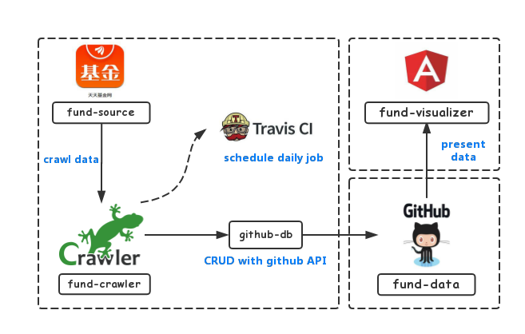
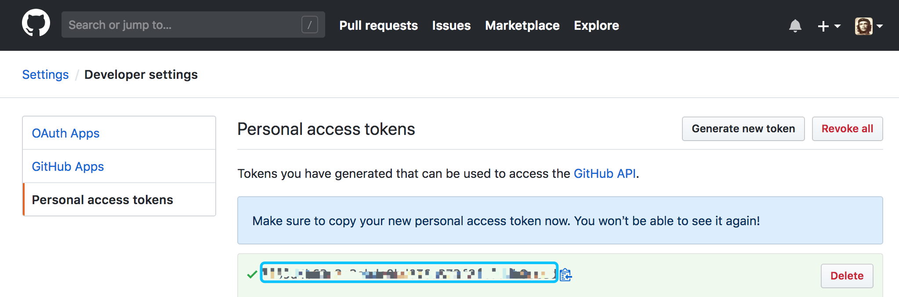
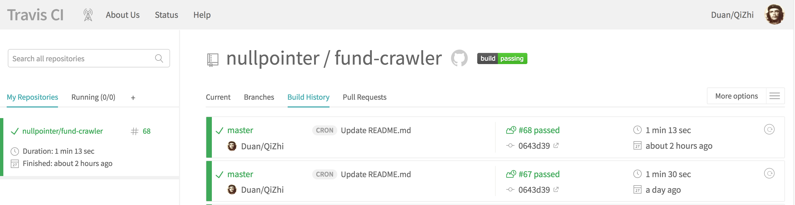
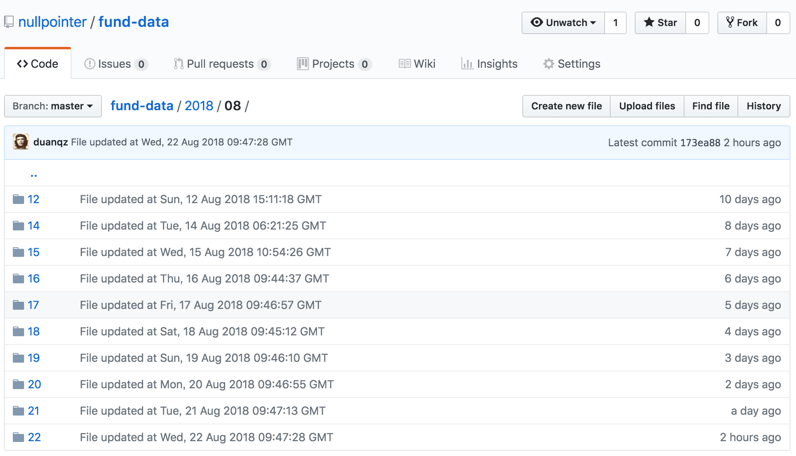
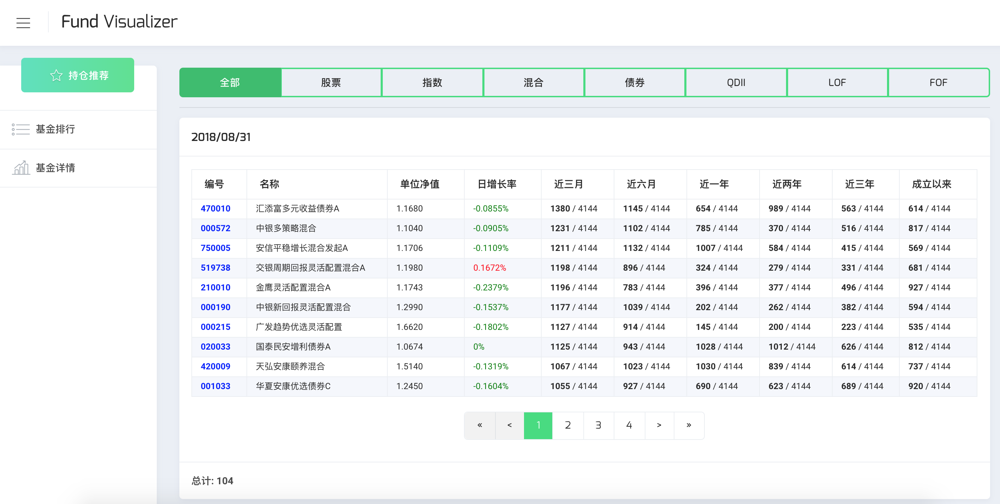
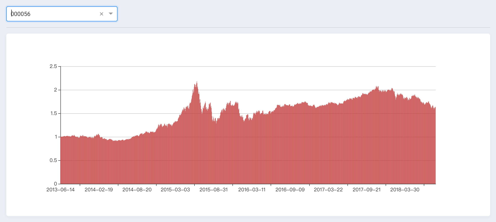

[](https://travis-ci.com/nullpointer/fund-crawler)

购买基金可以参考一个法则：

- 最近一年、两年、三年、五年及成立以来收益率排名同类基金的前`1/4`
- 最近三个月、六个月收益率排名同类基金的前`1/3`

笔者实现了一个应用，依据上述法则筛选基金，降低广大基民踩雷的风险。

本应用包含**数据爬虫**、**数据存储**和**数据展示**三个模块。本应用并没有采用传统的SQL作为数据库存储，而是直接利用Github作为数据存储服务器，并且利用[Travis-ci](https://travis-ci.com/nullpointer/fund-crawler)的持续集成功能定时调度爬虫任务，前端展示的域名和伺服也是利用Github提供的gh-pages功能。因此，本应用是一个前后端都寄生在**Github**和**Travis-ci**的**`免费应用`**。
架构图如下所示：

<div align="center"></div>

几乎每个编程语言都有爬虫框架，初学者大可基于自己熟悉语言的爬虫框架进行开发。笔者选择了JavaScript实现的[Crawler](https://www.npmjs.com/package/crawler)，相对于主流的爬虫框架，**Crawler**是比较冷门的，之所以选择它，是因为：

- 本文所要爬取的基金数据并不复杂(数据来源是[天天基金](http://fund.eastmoney.com/)，大部分数据可以直接通过调用数据API得到)，无需借用Scrapy、WebMagic、Pyspider等重型利器
- 本文将爬取的数据以JSON格式存储于Github，即后文中要展开的将Github作为云存储服务器，基于现有的JavaScript工具[GithubDB](https://www.npmjs.com/package/github-db)可以快速实现存储功能


# 数据爬取

本文实现的基金数据爬虫[fund-crawler](https://github.com/nullpointer/fund-crawler)完全基于NodeJS的，通过运行以下命令就能启动爬虫：

```sh
$ git clone https://github.com/nullpointer/fund-crawler
$ export TOKEN='Your github personal token'
$ cd fund-crawler
$ npm install
$ npm start
```

> **注意：** 运行本爬虫需要引入一个环境变量**TOKEN**，其值为Github的Personal Access Token，因为所爬取的数据会直接写入了一个Github上的代码库，而操作Github代码库的API最便捷的方式就是利用Personal Access Token。
>
> 在Github的开发者设置页<https://github.com/settings/tokens>，可以生成一个**TOKEN**：
>
> <div align="center"></div>

本爬虫要爬取的数据有两种：

1. **不同类型的基金排行**

    天天基金的排行可以通过API直接获取，不需要分析网页的结构，请求不同类型基金的API如下所示：

    ```javascript
    const rankUri = 'http://fund.eastmoney.com/data/rankhandler.aspx?op=ph&dt=kf&ft=%s&rs=&gs=0&sc=zzf&st=desc&pi=1&pn=10000&dx=1'

    c.queue({ uri: Util.format(rankUri, 'all'), type: 'all' }); // 全部
    c.queue({ uri: Util.format(rankUri, 'gp'), type: 'gupiao' }); // 股票型
    c.queue({ uri: Util.format(rankUri, 'hh'), type: 'hunhe' }); // 混合型
    c.queue({ uri: Util.format(rankUri, 'zq'), type: 'zhaiquan' }); // 债券型
    c.queue({ uri: Util.format(rankUri, 'zs'), type: 'zhishu' }); // 指数型
    c.queue({ uri: Util.format(rankUri, 'qdii'), type: 'qdii' }); // QDII
    c.queue({ uri: Util.format(rankUri, 'lof'), type: 'lof' }); // LOF
    c.queue({ uri: Util.format(rankUri, 'fof'), type: 'fof' }); // FOF
    ```

    请求URL的一个参数为`ft`，取不同的值表示不同的的类型。

2. **每个基金的历史净值**

    天天基金的历史净值也可以通过API直接获取，请求一直基金的历史净值的API如下所示：

    ```javascript
    const uri = "http://fund.eastmoney.com/f10/F10DataApi.aspx?type=lsjz&code=%s&page=1&per=%s"

    Util.format(uri, code, records),
    ```

    请求参数中的`code`为基金的编码，`per`为历史净值数据量。


# 数据存储

Github可以作为数据存储服务器，在Github上新建一个库(Repository)，数据便可以文件的形式存储起来。本爬虫设置了默认的数据存储库；如果要更换成其他库，可以在[db.js](https://github.com/nullpointer/fund-crawler/blob/master/src/db.js)文件中可以修改以下代码片段：

```javascript
    const options = {
        owner: 'nullpointer',  // 修改为用户名
        repo: 'fund-data',     // 修改为库的名称
        ...
    };
```

所谓的数据存储，其实就是往Github提交改动。[GithubDB](https://www.npmjs.com/package/github-db)实现了一个Github库的增删改查功能，就像操作普通的数据库一样，其内部的实现原理，就是利用Github提供的API来实现对Github库的读写操作。

该爬虫接入了[Travis-CI](https://travis-ci.com/nullpointer/fund-crawler)，配置了定时任务，每天都会自动运行，因此每天爬取的基金数据会自动提交到Github上的数据存储库。

<div align="center"></div>

当爬虫执行完毕，所爬取的数据就自动提交到了默认的<https://github.com/nullpointer/fund-data>，截取片段如下所示：

<div align="center"></div>

# 数据展示

数据展示基于Angular 6、Bootstrap 4和[Nebular](https://github.com/akveo/nebular)实现，是一个部署在github上的前端页面。

点击访问<https://duanqz.github.io/fund-visualizer>，主要展示以下三部分信息：

- **持仓推荐**：对于爬取的基金排行数据，会根据一年、两年、三年、成立以来、三个月、五个月的收益率进行排序，找出位于头部的基金
- **基金排行**：展示不同类别基金的排行榜
- **基金详情**：目前仅展示基金的历史净值图表

<div align="center"></div>

<div align="center"></div>

# 总结展望

相比于传统的前后端设计，本方案利用github作为后端存储和前端展示服务器，利用travis-ci持续集成作为爬虫任务调度，做到了**服务器投入零费用**，是一款完全架设在现有免费资源上的应用。但由于数据存储没有采用SQL，在数据读取方面的性能并不强。

后续的工作计划：

1. 爬虫优化：爬取更多基金信息，包括基金经理、持仓、评价等
2. 数据分析：AI模型分析基金数据
3. 展示优化：根据爬虫数据展示更多的基金信息，展示基于数据分析的推荐基金
